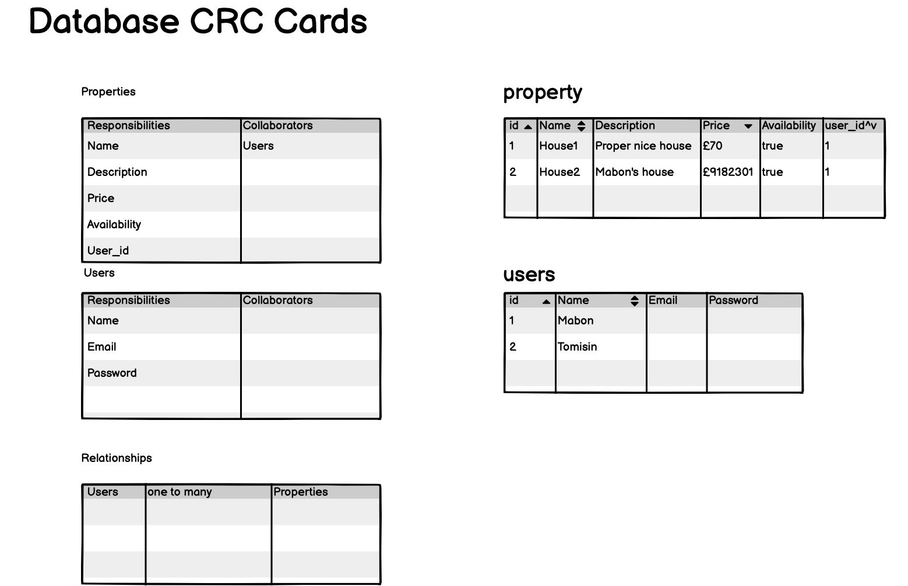
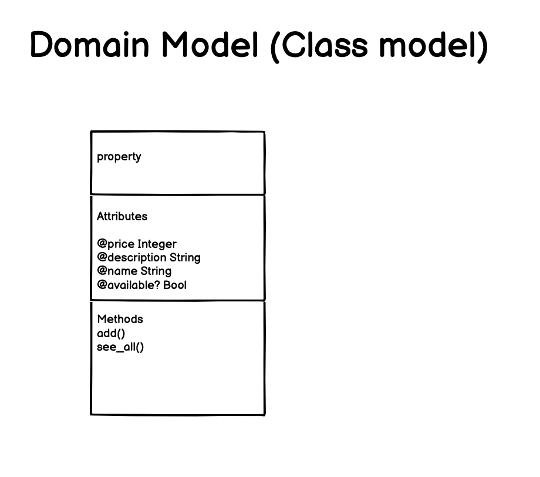
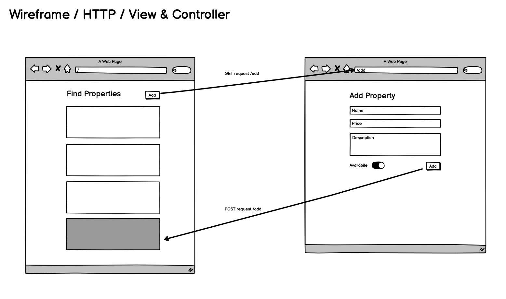

# Makers_bnb

# Project Description

This project was inspired by AirBnb, it will allow property owners to list multiple properties to rent, and renters to be able to book that property if it is available on their selected dates.

# Our Team

[](https://github.com/Maby0) Mabon

[](https://github.com/EMDevelop) Ed

[](https://github.com/rhianeKobar) Shakira

[](https://github.com/TomisinJ) Tomisin

# Our Approach

#### High level analysis of requirements

- We started with a list of [Headline and Nice-To-Have](https://github.com/adam-p/markdown-here/wiki/Markdown-Cheatsheet) features
- We read through these as a team, splitting them out into:

```
MVP v1
- (anyone) Showing listed properties
- (anyone) Adding Properties
- Property has availability Bool

MVP v2
- Renter + Listner Signup
- Renter + Listner Authentication

Features to Add Later

- Lister list a new space
- Lister offer range of dates
- Lister Accept hire request
- Renter request hire
- Renter cannot see a booked property
```

#### Breaking down User Stories

##### MVP

```
As a User
So that I can choose a place to stay
I want to see all the available properties

As a User
So that I can rent out my property
I want add properties to the current listing

As a User
So that I don't book an unavailable property
I want only see available properties
```

##### Completed nice to haves

```
As a User
So that I can return to the website
I want to be able to log in with my sign up details

As a User
So that I can have a profile
I want to sign up to makersbnb


```
-----
### Modelling
<br><br>

Database CRC cards 

<br>

Domain Model 

<br>

HTTP view and controller 
<br>

------

### Database set-up

1. Connect to `psql`
2. We need to create two databases, for the database follow the commands in <br> Database: `db/migrations/database_setup.sql` file<br>
Test_database: `db/migrations/test_db/test_database_setup.sql`
